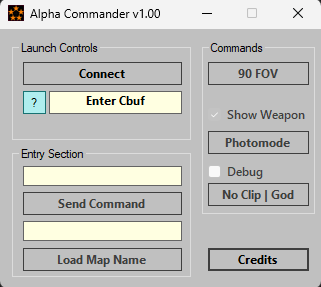

# Alpha-Commander
Alpha Commander is an RTM tool that allows you to quickly access commands/map files for ANY Call of Duty build.

Found a build? Simply paste the Cbuf into the tool and launch functioning map files without having to wait for community patches.

This tool is currently only for RGH consoles running the JRPC plugin. Xenia version is currently out of the question.

#Features
Can currently:

Simply paste the Cbuf

Load map files of either Campaign or Multiplayer

Enter commands

Basic Photo Mode where all UI is toggable.

# Credits
Heaventh - uint textbox entry conversion
