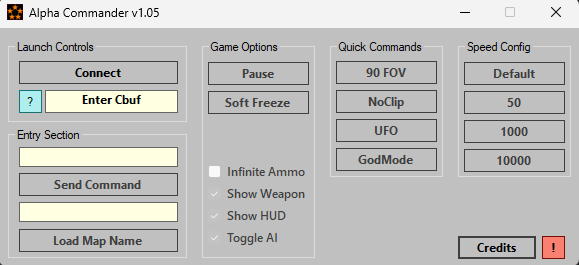

# Alpha-Commander
RTM tool that offers quick access to commands/maps on any build of COD on Xbox 360.

List of every **Cbuf_addText** can be found [HERE!](https://github.com/eh-K/all-COD-cats)

Only supports RGH consoles running the JRPC plugin.

## Features

> - Paste the Cbuf_addText offset.
> - Load any map files.
> - Quick/Enterable commands for easy access.
> - Makes checking prototypes much quicker.

## Credits
**Heaventh** 
- Base code to send commands.
- uint textbox entry conversion

## Disclaimers
- I am not liable for any data loss, corruption, or hardware issues that may occur.
- This tool is simply a command runner for RGH consoles.
- This tool is primarily made for experimental or prototype games that may be unstable.
